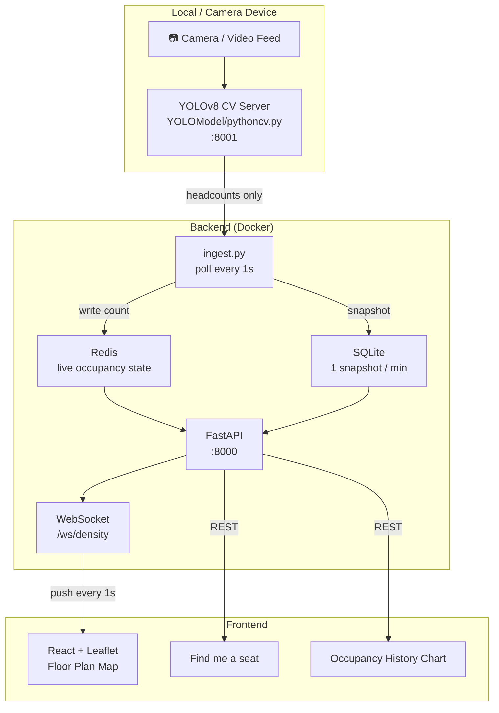

# CrowdMap

Real-time campus occupancy monitoring for Northeastern University Seattle — 225 Building, 2nd Floor.

---

## Architecture



**Privacy-first design:** video never leaves the local device — only headcounts are transmitted.

---

## Features

- **Real-time floor plan** — color-coded zone overlays (low / medium / high) update every second via WebSocket
- **Find me a seat** — recommends the least crowded area, sorted by occupancy ratio
- **Occupancy history** — sparkline chart showing the past hour per zone
- **Space density** — cross-zone comparison normalized by area size
- **Live viewer count** — header shows how many people are currently viewing the dashboard
- **Privacy-first CV** — YOLOv8 detects headcounts only; no video is stored or transmitted
- **Containerized** — backend stack runs with `docker compose up`

---

## Tech Stack

| Layer | Technology |
|-------|-----------|
| Computer Vision | Python, OpenCV, YOLOv8 (Ultralytics) |
| Backend | FastAPI, WebSocket, Redis, SQLite |
| Frontend | React, Leaflet (react-leaflet) |
| Infra | Docker, GitHub Actions CI |

---

## Installation

**Prerequisites:** Python 3.11+, Node.js, Redis (`brew install redis`)

### 1. CV Server dependencies

```bash
cd YOLOModel
python3 -m venv venv && source venv/bin/activate
pip install opencv-python ultralytics fastapi uvicorn
```

### 2. Backend dependencies

```bash
cd backend
python3 -m venv venv && source venv/bin/activate
pip install -r requirements.txt
```

### 3. Frontend dependencies

```bash
cd frontend
npm install
```

---

## How to Run Locally

Open **three terminals** and run each step in order.

---

### Terminal 1 — Redis + Backend (Docker)

```bash
CV_SERVER_URL=http://host.docker.internal:8001/api/current_count docker compose up --build
```

This starts Redis and the backend together inside containers.

---

### Terminal 2 — CV Server (camera / video)

```bash
cd YOLOModel && source venv/bin/activate
python3 pythoncv.py
```

Edit `cameras_config.json` to point each area at a camera index (`0`) or a video file path.

---

### Terminal 3 — Frontend

```bash
cd frontend && npm start
```

Open [http://localhost:3000](http://localhost:3000).

---

> **Port already in use?**
> ```bash
> kill -9 $(lsof -ti :<port>)
> ```

---

### Running without Docker

If you prefer not to use Docker, start Redis and the backend manually instead of Terminal 1:

```bash
brew services start redis

cd backend && source venv/bin/activate
uvicorn main:app --host 0.0.0.0 --port 8000
```

---

## Performance

| Metric | Value |
|--------|-------|
| Detection accuracy | ~90% (YOLOv8n) |
| End-to-end latency | < 2s |
| WebSocket push interval | 1 second |
| Historical snapshot interval | 1 minute |
| Zones monitored | 4 |

---

## Project Structure

```
crowdmap/
├── YOLOModel/
│   ├── pythoncv.py          # Live YOLOv8 CV server (port 8001)
│   ├── detector.py          # YOLOv8 inference + motion filter
│   └── cameras_config.json  # Camera / video source config
├── backend/
│   ├── main.py              # FastAPI app, REST + WebSocket
│   ├── ingest.py            # Background CV poller (1s interval)
│   ├── cache.py             # Redis helpers
│   ├── db.py                # SQLite schema and queries
│   ├── test_main.py         # pytest test suite (8 tests)
│   └── requirements.txt
├── frontend/
│   └── src/App.js           # React + Leaflet dashboard
├── docker-compose.yml
└── .env.example
```

---

## CI

GitHub Actions runs on every push and pull request to `main`:

- **Backend tests** — pytest (8 tests, no external services required)
- **Frontend build** — `npm run build`

---

## Future Improvements

- PostgreSQL / RDS for persistent historical data
- Multi-floor support
- People flow direction detection
